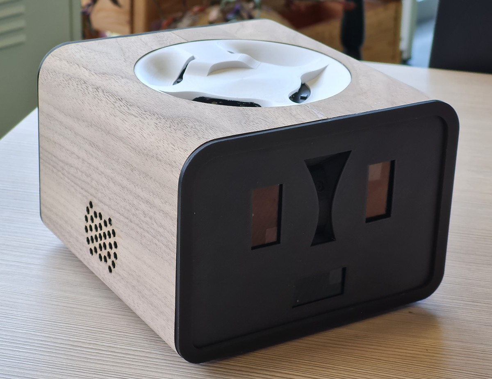
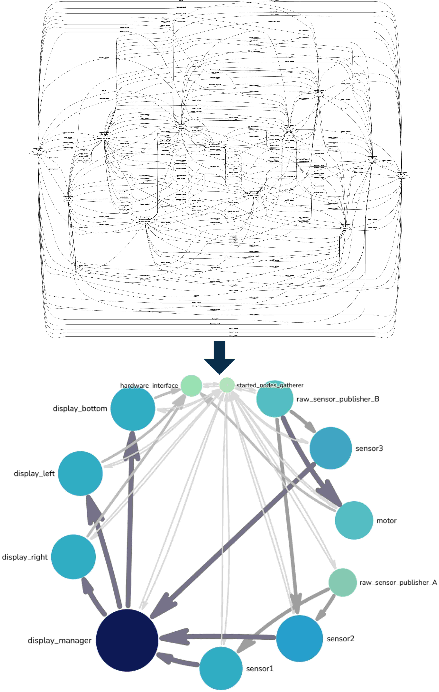
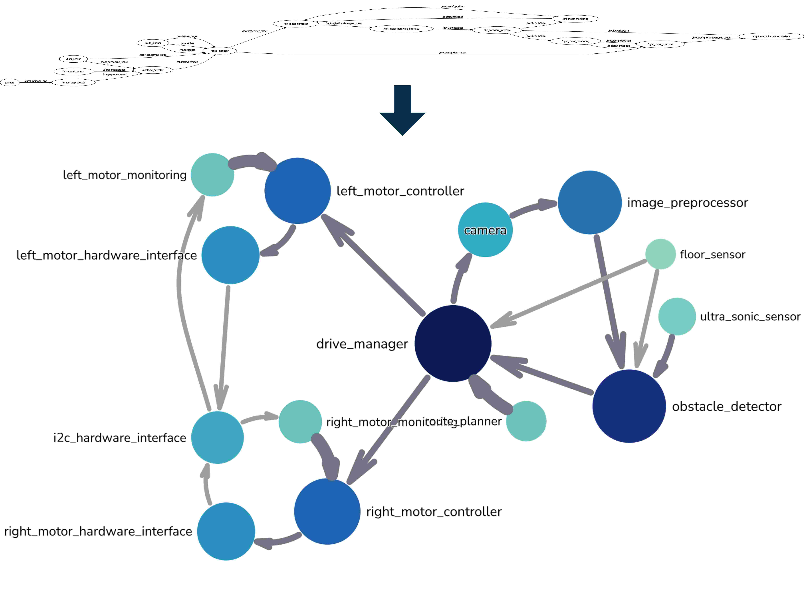
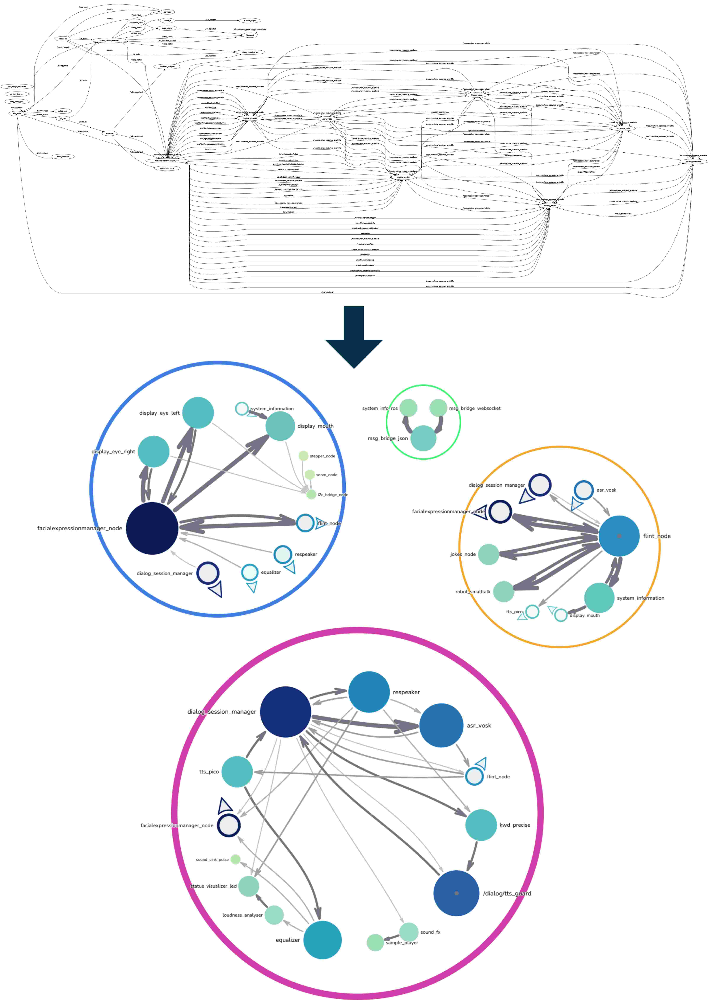

# Hi there, I'm Valentin 👋

For some time now, I have been enthusiastic about the idea of making projects publicly available, especially if they improve something that I previously found lacking. This makes them easier for me to find again (😉), and they may also be useful to you at some point.

## Some useful tools

#### Battery Lifetime for Embedded Systems

A [tool to calculate](https://vschroeter.github.io/battery-lifetime-calculator/) the battery lifetime of battery-powered embedded systems with actually useful options to add sleep current, self-discharge, leakage currents, and multiple active phases:

Too often I found myself calculating the battery lifetime for different projects using Excel. 
And sadly, the tools that are found online are often much too restrictive and not really useful for more than the most basic calculations.

#### Plank Cut Planner

A [tool to optimize the shopping list](https://github.com/vschroeter/plank-cut-planner) for DIY furniture planks based on required pieces and available planks in a given store:

I love building wooden furniture, half my home contains most diverse shelves and cabinets.
And again, I found myself calculating the cheapest possible combination of planks to buy from my local hardware store to build a planned piece of furniture.
This tool finds exactly that (at least for a reasonable small problem size 😎).

## Other cool stuff

### Python Projects

- [Extended ConfigParser](https://github.com/vschroeter/extended-configparser)
  A more flexible and interactive config parser for Python.
- [Mic Stream Util](https://github.com/icampus-wildau/mic-stream-util)
  A library to efficiently handle microphone streams for other applications, also offering a useful CLI.
- [Markdown Plus](https://github.com/icampus-wildau/markdown-plus)
  A cli / pre-commit hook to dynamically generate Markdown files from templates and other sources.
- [Pakk Package Manager](https://github.com/icampus-wildau/pakk)
  A quite powerful package manager for multi-language projects and GitHub / GitLab as package registry. Originally designed for supporting the development on robotics applications using ROS 2. Pakk not only supports the easy installation of pakkages of different types, but also (auto-)starting / stopping of executable pakkages. 

### Virtual Linker Plugin for Obsidian

If you're an [Obsidian](https://obsidian.md/) user, you might find my [Virtual Linker Plugin](https://github.com/vschroeter/obsidian-virtual-linker) useful.  

### Fun Projects

#### Hand Skeletonization

A project for the interactive exhibition *NANO Potsdam* for children and families to learn about realtime image processing with AI. I really like how the look of the website turned out and how it is fun to watch the digital skeleton of your own hand.

---

I've begun my studies in Telematics at the [University of Applied Sciences Wildau, Germany](https://en.th-wildau.de/), and worked on various projects related to IoT & smart home automation, humanoid robotics, ambient assisted living, software development, and more.
My [bachelor thesis](https://opus4.kobv.de/opus4-th-wildau/frontdoor/index/index/docId/1586) was about the development of an alternative to the NAO robots we used in the university.
The result was "ROS-E", a table robot platform focusing on social human interaction and with everything -- from hardware to software to design -- in our hands.
ROS-E has accompanied me and many other people during internships and theses over the years, and our team even won [two awards](https://innohub13.de/innofab-gewinnerinnen-2022/) with her and the ideas we came up with!!

After studying telematics for a few years, I decided to pursue a master's degree in IT Systems Engineering at the [Hasso Plattner Institute](https://www.hpi.de/) in Potsdam, Germany.
My [master thesis](https://github.com/vschroeter/VisCom-Thesis) arose from the problem of totally chaotic visualizations of complex communication graphs, as in ROS / ROS2 which I had to deal with during my robotics projects.
I've proposed some new sorting algorithms and visualization / layout techniques to improve the readability of those graphs, to go from the current commonly used cluttered visualization to a more comprehensible one:

<table>
  <tr>
    <td align="center" valign="middle" width="33%">
      
    </td>
    <td align="center" valign="middle" width="33%">
      
    </td>
    <td align="center" valign="middle" width="33%">
      
    </td>
  </tr>
</table>

If you wanna read more about myself, feel free to check out my [Interview with "Studying in Brandenburg, Germany"](https://studieren-in-brandenburg.de/telematikerinnen-koennen-nicht-nur-programmieren-wenn-es-praktische-probleme-in-der-realen-welt-gibt-dann-koennen-wir-auch-mit-der-entsprechenden-hardware-umgeh/).

## Publications

- 2025 [A Graph Layout Evaluation System for Communication Graphs](https://doi.org/10.2312/evp.20251138):
  -  Valentin Schröter, Willy Scheibel, and Jürgen Döllner.
  -  27th EG Conference on Visualization (EuroVis '25)
  -  [doi:10.2312/evp.20251138](https://doi.org/10.2312/evp.20251138)
- 2021 [NetSD: Remote Access to Integrated SD Cards of Embedded Devices](https://arxiv.org/abs/2109.15322):
  -  Valentin Schröter, Arne Boockmeyer, and Lukas Pirl
  -  9th IEEE International Conference on Cloud Engineering (IC2E '21)
  -  [doi:10.48550/arXiv.2109.15322](https://doi.org/10.48550/arXiv.2109.15322)
- 2019 [Prototypal construction of a table robot as a future development and research platform in the area of Ambient Assisted Living and as an alternative for the NAO-Robot](https://opus4.kobv.de/opus4-th-wildau/frontdoor/index/index/docId/1586) 
  - Valentin Schröter, Janett Mohnke, Janine Bressler
  - [doi:10.15771/BA_2019_1](https://doi.org/10.15771/BA_2019_1)  

<!-- 
  
 -->

<h3 align="left">Connect with me:</h3>

<h3 align="left">My favorite programming technologies right now:</h3>

<h3 align="left">Stuff I've already worked with:</h3>

                                             

<!-- 

&nbsp;
 -->

<!--
**vschroeter/vschroeter** is a ✨ _special_ ✨ repository because its `README.md` (this file) appears on your GitHub profile.

Here are some ideas to get you started:

- 🔭 I’m currently working on ...
- 🌱 I’m currently learning ...
- 👯 I’m looking to collaborate on ...
- 🤔 I’m looking for help with ...
- 💬 Ask me about ...
- 📫 How to reach me: ...
- 😄 Pronouns: ...
- ⚡ Fun fact: ...
-->
